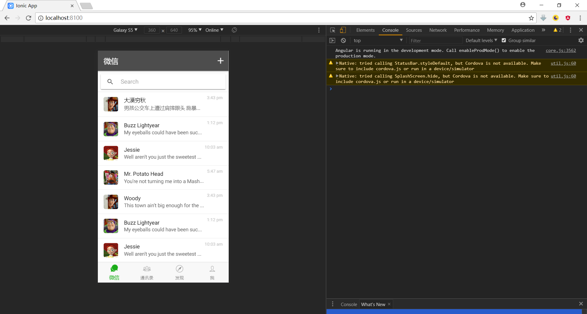

### NiceFish（美人鱼）

NiceFish是一个系列教学项目，目标是全面示范Angular在浏览器、移动端、Electron环境中的用法。

- NiceFish：美人鱼，这是一个微型Blog系统，前端基于Angular 4.x + PrimeNG。http://git.oschina.net/mumu-osc/NiceFish/

- NiceFish-Admin：这是系统管理界面，基于Angular 4.x+PrimeNG，http://git.oschina.net/mumu-osc/NiceFish-Admin

- NiceFish-ionic：这是一个移动端的demo，基于ionic。http://git.oschina.net/mumu-osc/nicefish-ionic

- NiceBlogElectron：https://github.com/damoqiongqiu/NiceBlogElectron ,这是一个基于Electron的桌面端项目，把NiceFish用Electron打包成了一个桌面端运行的程序。这是由ZTE中兴通讯的前端道友提供的，我fork了一个，有几个node模块的版本号老要改，如果您正在研究如何利用Electron开发桌面端应用，请参考这个项目。

### 产品代码

OpenWMS是一个开源产品，复杂度比NiceFish高，请不要用此项目进行入门学习。

- OpenWMS：https://gitee.com/mumu-osc/OpenWMS-Frontend ，这是OpenWMS项目的前端代码，基于当前最新的Angular 5.2.0和PrimeNG 5.2.4。

### 在线演示

NiceFish:    http://47.104.13.149:4200

NiceFish-Admin:   http://47.104.13.149:8080

OpenWMS：http://47.104.80.251:4200

NiceFish-ionic：https://damoqiongqiu.github.io/NiceFish-ionic/

### 本项目运行效果

### 用法

克隆本项目之后，命令行进入项目根目录。

- cnpm install -g cordova ionic
- cnpm install
- ionic serve

打开你的浏览器访问http://localhost:8100/

### 构建

    npm run ionic:build --prod

### 把应用添加到手机桌面

打开你的safari浏览器或者chrome浏览器，访问https://damoqiongqiu.github.io/NiceFish-ionic/

然后选择“添加到主屏幕”，就像这样：

然后你就可以看到应用图标出现在主屏幕上了：

### 在线交流QQ群

<a target="_blank" href="//shang.qq.com/wpa/qunwpa?idkey=8db5ed802cbddbf6432d7ba7dc4f2a316be020442491eb41cbfb1a12434e8cc7" class="list-group-item"><i class="fa fa-qq" aria-hidden="true"></i> Angular-1区-丝绸之路:286047042（满）</a>

<a target="_blank" href="//shang.qq.com/wpa/qunwpa?idkey=cbfcd79e7e90939b0e2c519f475fac4792985ce2abc5ad45ec5e06ffcfe944dd" class="list-group-item"><i class="fa fa-qq" aria-hidden="true"></i> Angular-2区-敦煌:139357161（满）</a>

<a target="_blank" href="//shang.qq.com/wpa/qunwpa?idkey=639229c8b6ad0c3a9a8f381dddf5d7785780b20d8c37eb25c91ac73ea7d37a5f" class="list-group-item"><i class="fa fa-qq" aria-hidden="true"></i> Angular-3区-玉门关:473129930（满）</a>

<a target="_blank" href="//shang.qq.com/wpa/qunwpa?idkey=12add102af3f67910bdc0de753dee10ebada08ab485af7e38f4dfa0ee27476f7" class="list-group-item"><i class="fa fa-qq" aria-hidden="true"></i> Angular-4区-河西走廊:483016484（满）</a>

<a target="_blank" href="//shang.qq.com/wpa/qunwpa?idkey=1293a6494fb306ea29d281e320a8f4ef82285fa5300f73118e6ff7a79ce76036"
class="list-group-item"><i class="fa fa-qq" aria-hidden="true"></i>
Angular-5区-楼兰:604253120（将满）
</a>

<a target="_blank" href="//shang.qq.com/wpa/qunwpa?idkey=fcd880ba919983dc85690642d48cf00ad0affd8d35de5f30542c895e622a8ab8"
class="list-group-item"><i class="fa fa-qq" aria-hidden="true"></i>
Angular-6区-凉州:124641447（将满）
</a>

<a target="_blank" href="//shang.qq.com/wpa/qunwpa?idkey=5d6b8c5296e4806142b8422ae7abca6f27b9b9b992a4dac80dc1392644e8970a"><i class="fa fa-qq" aria-hidden="true"></i>脚本娃娃-桃花岛-83163037（将满）</a>

如果您有Angular相关的问题需要讨论，或者单纯想跟我Say Hello，请加上面几个扣扣群。注意，我每天都会收到大量的求助消息，真的有点忙，所以请您优先在扣扣群里面讨论问题。

### 学习资源和视频教程

大漠演讲中的所有PPT已经本项目对应的资料都在这里，您可以随意使用，https://gitee.com/mumu-osc/NiceFish/attach_files 。

如果您需要教程，请自己来这里查看，http://www.ngfans.net/ ，有视频也有文字，有免费版本也有收费版，您自己看着选。

### 开源许可证
 MIT

 你可以随意使用此项目，无需通知我，因为我可能很忙没空搭理你。
